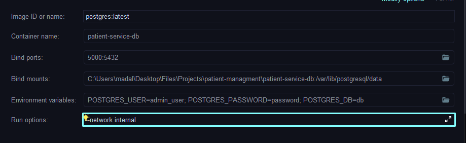
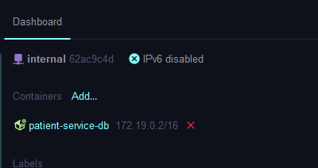

# 🩺 Patient Management API

https://www.youtube.com/watch?v=tseqdcFfTUY&list=PLU9fGabY-d0wpp1QzE1yAd4EqOS3ONnD2&index=1
https://github.com/chrisblakely01/java-spring-microservices

This is a **Spring Boot** application that provides a REST API for managing patient records. The application follows best practices for RESTful design and includes **OpenAPI 3.1** documentation using **Swagger UI**.

---

## 📌 Features

- CRUD operations on patients:
    - Create a new patient
    - Retrieve all patients or by ID
    - Update patient details
    - Delete patient
- Integrated OpenAPI documentation (Swagger)
- Follows RESTful conventions

---

## 📁 Project Structure

- `PatientRequestDTO`: Data Transfer Object for patient details.
- `PatientController`: Handles the API endpoints for patients.
- `Swagger/OpenAPI`: Automatically generated documentation for API endpoints.

---

## 📖 API Documentation

### 🔗 Swagger UI

Access a user-friendly UI to explore and test the API:

http://localhost:8080/swagger-ui/index.html


### 🔗 OpenAPI JSON Specification

Download or view the raw OpenAPI 3.1 spec:

http://localhost:8080/api-docs

---

## 🚀 Deployment & Artifact Publishing

This project is configured to deploy WAR artifacts to a **Nexus Maven repository**. You can upload your built WAR files to your Nexus server for artifact management and sharing.

### Nexus Setup in `pom.xml`

```xml
<distributionManagement>
  <repository>
    <id>nexus-releases</id>
    <url>http://localhost:8081/repository/maven-releases/</url>
  </repository>
  <snapshotRepository>
    <id>nexus-snapshots</id>
    <url>http://localhost:8081/repository/maven-snapshots/</url>
  </snapshotRepository>
</distributionManagement>
```
Use the my-settings.xml that stores the credentials for the Nexus repository.

```xml
<settings>
  <servers>
    <server>
      <id>nexus-snapshots</id>
      <username>admin</username>
      <password>admin</password>
    </server>
  </servers>
</settings>
```

Use the command below to deploy your WAR file:

```bash
mvn deploy --settings ./my-settings.xml -DskipTests
```

If you want to push to Nexus to /maven-snapshots, uncomment the following line in your pom.xml:

```xml
<version>1.0.0-SNAPSHOT</version>
```

Otherwise, if you want to push to /maven-releases, comment the above line and uncomment the following line:

```xml
<version>1.0.0</version>
```

## Deploy to Docker

To deploy this application in a Docker container, you can use the provided `Dockerfile`. This file builds a Docker image for the Spring Boot application.

### Build the Docker Image

Use the maven → Plugins → spring-boot → build-image goal to create a Docker image

### DB on Docker



The internal network is being created
- Inside Intellij Go to Services → Docker → Network → Create Network
- 
